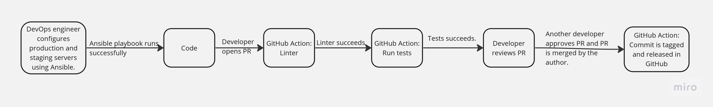
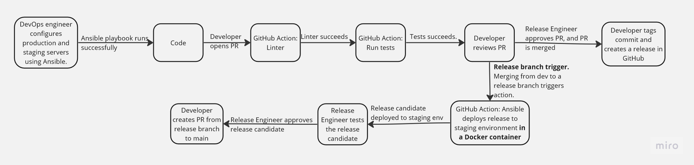
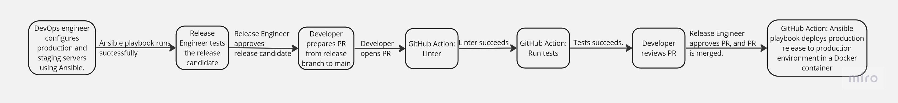

# CSC-519-DevOps-Pipeline

## Team Members

Andrew Shon (ashon)

Isaac Taylor (itaylor)

Corey Capooci (cvcapooc)

## Our Tagline
Free and easy flow. Just let the pipeline go.

## Problem Statement & Description

### The Problem
In software development, implementing a functioning product is only a minor step in creating production-ready tools and applications. Before a release, it is essential to ensure that all contributions to the software are well-tested and reviewed. Maintaining the integrity of an application is equally important and requires safeguards to prevent accidental or intentional code changes that may degrade quality. In modern development, it is common for multiple teams to work together on one application. For this reason, it becomes apparent that a way to protect, build, and deploy applications quickly and efficiently should be in place. Even after deployments, managers and developers must account for the high possibility of changes made at any given time, and this leads us to our main problem: the significant amount of time and effort required to manually follow a process for safe application development, testing, and deployment. 

### Why does this problem matter / Who cares or who is impacted
The consequences of not having a process for continuously integrating and deploying changes for applications are wide-reaching. In the worst-case scenario, customers may experience slow releases. For example, marketing may promise new functionality in an application. However, it may take a long time for these changes to make it to production without an effective process for testing and deploying new features. Developers can be affected by the burden of manually executing tests for every change, setting up deployment schedules, etc. Stakeholders may become inconvenienced if their interests in a software project are not prioritized. For teams to efficiently deliver software, there must be a way to automate this process. Fortunately, the solution to this issue is the creation of a solid DevOps Pipeline. 

### What does your pipeline do? Why is a pipeline a good solution for the problem?
The Pipeline will be responsible for testing, building, and deploying application code. Changes committed to a designated repo will undergo a series of quality checks. This process will involve linting to enforce best practices in the code for the coffee-project application. The Pipeline will automatically run unit tests and require a 100% pass rate and 80% code coverage before allowing merges into the development, release, or main branch. Code reviews will be mandatory through the enforcement of a branch protection rule that will require at least one reviewer before merging code into a protected branch. The Pipeline will deploy containerized releases on a staging and production server. We believe that it will be a good solution for proactively reducing the number of software defects that tend to appear in deployments. Testing and reviewer requirements will serve as time savers by allowing developers to fail faster and catch bugs early on.  

### Does your pipeline have interactions with users, or does it just in response to events?
One primary goal of this Pipeline is to prevent excessive human interaction needed to deliver applications. We will architect an event-driven Pipeline to accomplish this goal. Actions will occur in response to PRs, comments, reviews, branch merges, and the creation of releases. Developers and Release Engineers will be responsible for doing basic tasks in a repo to kick off different flows. We anticipate some initial manual actions that will be prerequisites for successfully running our Pipeline. The manual requirements will include the setup of and creation of VMs that will host deployments. For this, we will utilize Ansible as our configuration tool. 

## Use Case

```
Use Case: PR created that aims to merge feature branch to develop branch so that automated testing
and linting triggers on the feature branch code
1 Preconditions
   Self-Hosted GitHub Actions system provisioned.
   A feature branch exists.
2 Main Flow
   After the development engineer commits their implementation into a feature branch, they open a new 
   pull request that points from their feature branch to the target branch, develop [S1]. Then, the pull 
   request Github Actions workflow will detect the event of pull request creation from the previous subflow.
   The first step of the workflow will run, where linting will check the codebase snapshot from the feature 
   branch [S2], ensuring that proper code hygiene and rules are enforced from the team's linting rules that 
   are established [S3]. After the linting finishes execution, the results will be displayed in the Github 
   Actions run [S4]. Assuming linting passes, the automated test suite is run [S5]. After the test suite finishes execution, the results
   are posted in the Github Actions run [S6]. During the pull request process, another engineer performs static 
   analysis on the feature code changes (aka "diff time") and approves changes (assuming they line up with team/business 
   standards) [S7]. Finally, with passed linting, testing, and an approval, the pull request is then merged in [S8].
3 Subflows
  [S1] Development engineer will open a new pull request that points develop from their feature branch.
  [S2] Pull Request Github Actions workflow initiates.
  [S3] Linting is run on the codebase snapshot from the feature branch.
  [S4] Linting results is returned/displayed.
  [S5] Automated test suite is run.
  [S6] Results of automated test suite is returned/displayed.
  [S7] An engineer other than the author reviews/approves the pull request.
  [S8] After approval, the pull request is merged in.

4 Alternative Flows
  [E1] Compilation fails.
  [E2] Test suite fails.
  [E3] Linting check fails.
  [E4] Reviewer engineer leaves a comment/suggestion in the pull request for further iteration.
```

## Pipeline Design

The pipeline design has three sub-pipelines depending on the action of the developer. The first pipeline is for pull requests from a feature branch to the dev branch. The second pipeline is for pull requests from the dev branch to a release branch. The third pipeline is from a release branch to the main branch. Note that the end of the second pipeline is intended to feed into the third pipeline since the second pipeline ends with the creation of a pull request into main. 

### Pull Requests from a feature branch to the dev branch



### Pull Requests from dev to a release branch



### Pull Requests from a release branch to main



### Constraints, Guidelines, Assumptions

* All pipelines assume that the hosts for the staging and production environments have been configured using an Ansible playbook and are ready for use.
* A Dockerfile exists in the repository for constructing the Docker container.
* Ansible scripts for constructing the staging environment and the production environments exist in the repository.
* Staging and production environments are expected to have enough data storage and compute resources to run the coffee-project app.
* GitHub Runners are expected to have enough data storage and compute resources to build the coffee-project app and run Ansible playbooks.
* GitHub Action will handle secrets to connect to the production and staging environments.
* The staging and production environments are configured using Ansible playbooks that are run manually before the pipeline begins.
