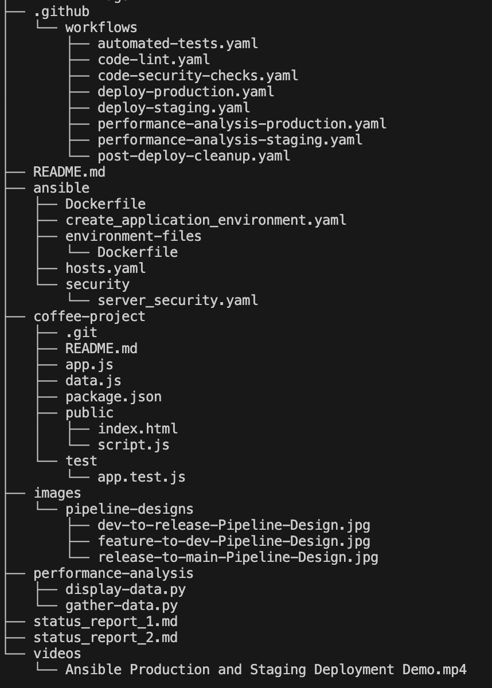

# CSC-519-DevOps-Pipeline

## Team Members

Andrew Shon (ashon)

Isaac Taylor (itaylor)

Corey Capooci (cvcapooc)

## Our Tagline
Free and easy flow. Just let the pipeline go.

## Project Structure

### .github/workflows/

This folder contains all github workflow files used in the pipeline.

### .github/workflows/automated-tests.yaml

This workflow runs unit and code-coverage tests for the application managed by the pipeline (coffee-project).

### .github/workflows/code-lint.yaml

This workflow runs a javascript linter that checks the application code for syntax errors and formats the code.

### .github/workflows/code-security-checks.yaml

This workflow runs a security check to detect any vulnerabilities that may exist in the
coffee-project before it can be merged into  a protected branch.

### .github/workflows/deploy-production.yaml

This workflow deploys the coffee project to the production environment.

### .github/workflows/deploy-staging.yaml

This workflow deploys the coffee project to the staging environment

### .github/workflows/performance-analysis-production.yaml

This workflow runs a program that analyzes and reports on the performance of the coffee-project  in the production environment.

### .github/workflows/performance-analysis-staging.yaml

This workflow runs a program that analyzes and reports on the performance of the coffee-project running in the staging environment.

### .github/workflows/post-deploy-cleanup.yaml

This workflow removes old images from previous deployments from the staging or production server after a release.

### .eslintrc.yaml

Configuration for the es-linter used for linting the coffee-project application.

### ansible/
This folder holds the files for configuring the staging and production environments.

### ansible/Dockerfile

This Dockerfile is used to create the container locally that will run the Ansible playbooks to configure the servers.

### ansible/create_application_environment.yaml

This Ansible playbook configures the staging and production environments for the coffee-project.

### ansible/hosts.yaml

These are the staging and production environments to configure.

### ansible/security 

This folder holds the files for improving security of the application’s servers.

### ansible/security/server_security.yaml

This Ansible playbook removes old packages and updates the current packages to improve the OS’s security.

### ansible/environment-files

This folder holds the files that are moved to the servers during server configuration.

### ansible/environment-files/Dockerfile

This is the Dockerfile used to create the Docker container for the coffee-project.

### coffee-project/

This is a Git submodule pointing to the coffee-project repo.

### images/

This folder holds the images used for the repo.

### images/pipeline-designs

This folder holds the images for the pipeline designs. 

### images/pipeline-designs/dev-to-release-Pipeline-Design.jpg

This image shows the flow for the DevOps pipeline when moving code from develop to a release branch.

### images/pipeline-designs/feature-to-dev-Pipeline-Design.jpg

This image shows the flow for the DevOps pipeline when moving code from a feature branch to develop.

### images/pipeline-designs/release-to-main-Pipeline-Design.jpg

This image shows the flow for the DevOps pipeline when moving code from a release branch to main.

### images/project-structure

This folder holds the images reflecting the project's structure. 

### images/project-structure/project-structure.png

This image shows the projects structure as folders and files.

### performance-analysis/

This folder holds the files for evaluating the performance of the coffee-project

### performance-analysis/gather-data.py

This is a Python3 script that gathers data about the response times of the deployed coffee-project.

### performance-analysis/display-data.py

This is a Python3 script that displays the data gathered from the gather-data script. This will create a box and whiskers plot showing the data.

### status_report_1.md

Our status report for sprint 1

### status_report_2.md

Our status report for sprint 2.

### videos/

This folder holds the videos for this repo.

### videos/Ansible Production and Staging Deployment Demo.mp4

This video depicts how to run the Ansible Playbooks to configure the staging and production environments.
