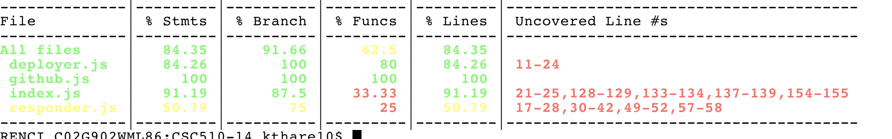

## Bot


### Bot Implementation

<!-- In implementing your bot, you will have to primary tasks:

* **Bot Platform**: Implement hooks into platform. You should be able to have a fully operational bot within your platform (Mattermost/Discord/Github) that can response to basic commands.
* **Bot Integration**: Implement basic conversation/interaction with bot. You need to support the ability to fully have an interaction with an bot as defined by your use cases. -->

We created a Mattermost bot named CelebrimBot. 
Celbrimbot has the ability to get responses from mattermost forms as well as reply to certain commands.
The User is able to type ```!help``` and CelebrimBot replies with a table listing all of the supported commands and their descriptions.
The User can also do slash commands like ```/createBot``` and ```/deployBot```. 
Bot of which promt the user with a form for details about the bot, once the user submits Celebrimbot takes tha Input and perfors the action specified in the /command.
Currently these operations are mocked and do not fully create a github repo or deploy that bot on docker. This will be the future implementation for those commands.

The bot is currently hosted on a aws instance. So the commands work by just going into Team-14's mattermost channel

### Use Case Refinement

The use cases have been modified and the updates are found [here](./DESIGN.md). The updates include removing the delete and update bot commands replacing them with the help and deploy commands. The help command displays to the user the features and commands associated with Celebrimbot. The deploy command deploys an already created bot to a docker instance where celebrimbot is hosted. The create bot command remains the same. It allows the user to create a Github bot with selected functionality. 

The changes simplify the development of the bot and improve its practicality. The addition of the help command allow the user to better understand how to use the bot.  The deploy command allows the user to easily deploy and use the bots created by Celebrimbot.  While the removal of the delete bot command, allows Celebrimbot to focus on features more useful to the user.  The conjunction of these updates makes Celebrimbot more practical.  The removal of the update bot command simplifies the design and implementation of Celebrimbot. 

### Test Coverage

<!-- Implement a set of tests to achieve >80% code coverage, as measured by `c8` (used in HW2).  All of your tests must have meaningful assert statements.  Your tests need to be runnable with the command `npx c8 npm test`. -->
The tests are located in the [test](./test) directory.  The tests can be run using the ```npx c8 npm test``` command.

The test coverage is 



### Mocking Service Component

<!-- Because the focus on your milestone is platform integration and bot interaction, you will not yet have a working service implementation. Implement mock services and data to support service integration. For example, if you were implementing a meeting bot that helps set up meetings, use mock calendar data to determine available meeting time, rather than integrate with a user's Google calendar. A proper mocking infrastructure would allow you to swap real and testing information in a single place, instead of hard-coded throughout your code base.

**Failure to use appropriate mocking/injection techniques will result in 0 credit for this section**. Do not do this:

```javascript
bot.hears("command", function(){ bot.replys("fake answer");});
``` -->

The Celebrimbot code currently mocks its interactions with Github and Docker. Any JSON files starting with mock contain the JSON objects used to mock the REST API return data. The Celebrimbot tests use the "nock" framework for mocking. The tests that use the mocking infrastructure can be found [here](./test).

### Screencast

<!-- Create a screencast of your bot performing your three primary use cases. Demonstrate your tests being executed. -->

[ScreenCast](https://drive.google.com/file/d/1ZDwC69kSwQL18v-a9vJo63Vn9STb1RaI/view?usp=sharing)


