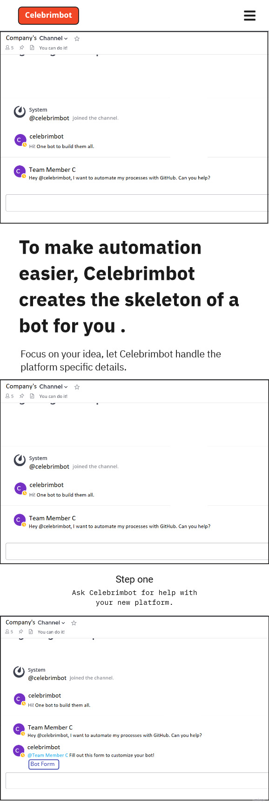
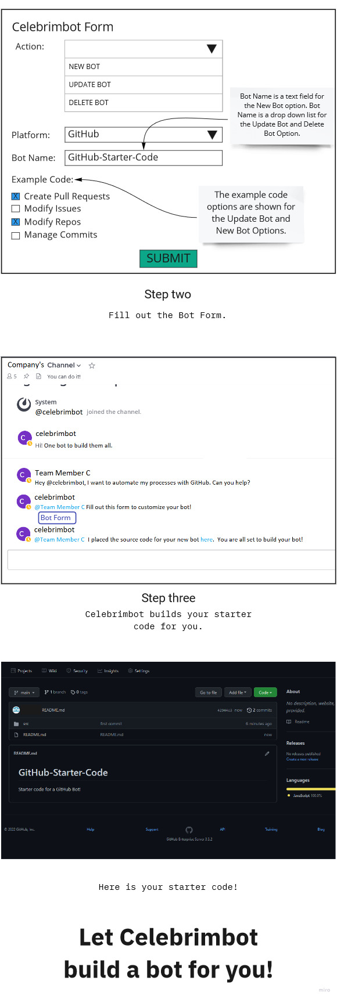
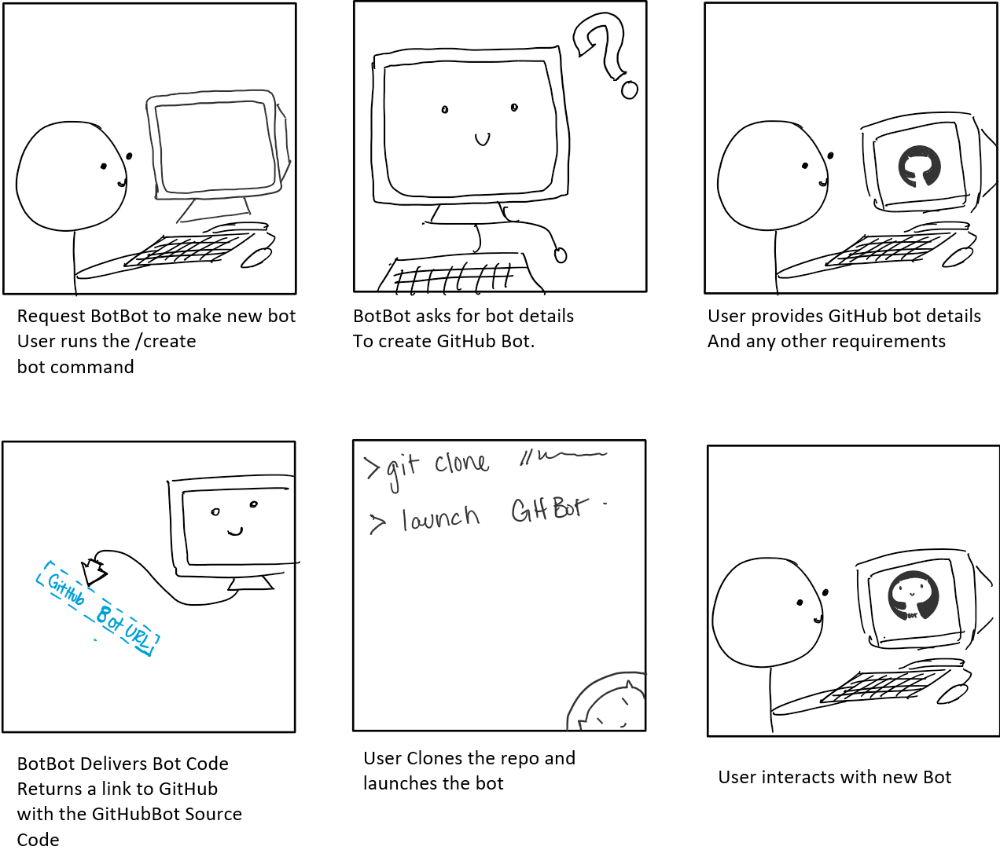
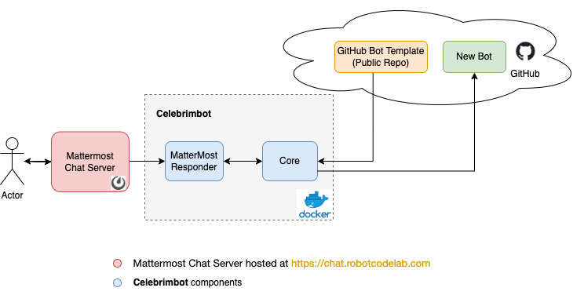
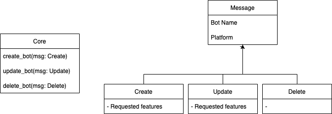
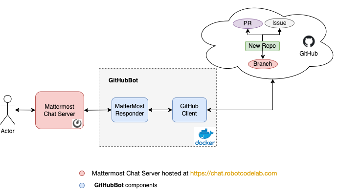

# Celebrimbot

## Problem Statement
When a team wants to automate its processes and decides a bot is the best solution, it is a daunting task to create the team's first bot or to learn a new platform's API for the latest bot. This leads to developers spending valuable time researching REST APIs for every new platform and for every new bot rather than spending time on producing time-saving automation. 

This problem impacts any team or developer looking to automate.  New and experienced developers alike need to understand each platform's REST API, utilize its API Tokens and understand basic bot setup.  Without having a basic structure to work from, every developer needs to overcome the inital knowledge gap with every new platform. Without a basic layout of the bot's key functionalities for a particular platform, there is  an increase cost of entry for implementing automation.  Anything that makes bot creation easier, makes automation easier. Without the basic structure of the bot, it may be unlikely that automation is adopted amongst the team. Therefore, everyone benefits from having a starting structure that allows them to focus on the bot's utility producing features and not on the platform specific implementations of the bot.  

## Bot Description

<!-- The tagline for this bot -->

Tagline: ***One bot to build them all***

<!-- What does your bot do? -->
<!-- How does this bot interact with the user? -->
<!-- Why is this bot a good solution for the problem? -->

Celebrimbot responds to queries from users to create bots. Celebrimbot creates bots for a variety of platforms. Celebrimbot waits in a channel on Mattermost for a developer to talk to it. To create a bot, the user messages Celebrimbot and says “I want to create a bot”. Celebrimbot then asks the user questions about what program the bot should use to communicate and what programs or services it should interact with and how. The user must provide Celebrimbot with the correct api tokens for the services requested. Celebrimbot supports creating bots for GitHub. For other platforms, Celebrimbot lets the user know if they have requested a platform that Celebrimbot does not support or if the user needs to provide an api token for the new bot to use.

Celebrimbot generates code that performs the basic functions that the user requested, such as creating repos, pull requests, and issues on GitHub. When a bot is requested, Celebrimbot creates a Github repository for the new bot, pushes the code and sends the link to the user. The new bot will be ready to deploy and have comments letting the user know where they can add additional functionality. The user can now focus on adding the more complex interactions instead of having to worry about researching the specifics of connecting to GitHub and using its API.

Celebrimbot does not fit cleanly into any of the bots discussed in class. Celebrimbot can be described as a reactor, a bot that responds to events with no memory of previous events, and lives on Mattermost.

## Use Cases

#### 1. Upgrade asks for help
 - Preconditions
	- User must have a chat api.
 - Main Flow
	- User asks for help with Celebrimbot by using the !help
	- Celebrimbot posts a table with a list of commands and their descriptions

#### 2. Create a GitHub Bot
 - Preconditions
    - User must have a chat api
 - Main Flow
	- User will request for Celebrimbot to create a Github bot by using the /createBot
	- The user is prompted with Celebrimbot Form asking for Bot Name, Select Platform, and select bot features
	- User inputs a name, selects github, and select's issues
	- CelebrimBot then creates a repo for The github Bot and posts the link to the source code.
 - SubFlows
	- User gets link an deploys the bot wherever they chose (ie. Docker Container)
 - Alternate Flow
 	- User Did not provide all information. Form throws errors highlighting missing information
	- User Provides an Invalide Name. Form promts the user to re-type the name

#### 3. Deploy your bot
 - Preconditions
	- User must have already created a bot.
 - Main Flow
	- User will request for Celebrimbot to deploy their bot /deploybot command
	- Celebrimbot prompts the user with a form asking for information on what bot to deploy:
	BotName and Github URL
	- CelebrimBot then deployes the bot in a docker instance where celebrimbot is being hosted. Once Done sends a message confirming deployd
 - Alternate Flow
 	- CelebrimBot was unable to deploy. Post error message about failure.

## Design Sketches

#### WireFrame

	

	

#### Story Board

## Architecture Design + Additional Patterns
### <B>Celebrimbot</B>

The Cleberimbot is designed to automate the creation of the GitHubBot which provides basic functionality to interact with the GitHub. The user can extend the generated GitHubBot based on their needs without worrying about how it interacts with the Mattermost chat server and GitHub. 

It consists of 2 main components (a) Mattermost Responder and (b) Core. 

#### <B>Mattermost Responder</B>
The Mattermost Responder is responsible for managing the user interaction via Mattermost Chat Server. It exposes three triggers: `create`, `update` and `delete`. It launches an interactive dialogue to gather information from the user.

The bot request following information for each of the triggers:
- Create
  - Bot Name
  - Platform (GitHub)
  - List of supported features 
  	- Repository Operations
	- Issues Operations
	- Pull Requests(PR) Operations
- Update
  - Bot Name
  - Platform (GitHub)
  - List of new features to be added 
- Delete
  - Bot Name

It then invokes the Core to perform the requested operation (i.e. `create`, `update` or `delete`) and sends a response to the user using the information received from the Core. The requested user is tagged in the response. 

#### <B>Core</B>
The core is responsible for creating, updating or deleting GitHubBot for the user based on the information received from the Mattermost Responder. 

##### <B>Create</B>
It creates a GitHubBot for the user by cloning GitHubBot template code from a public repository. It creates a new repository using this code with the name provided by the user. It also adds the user as the owner of the repository. `supported.features` file is added to the repository listing the set of features supported. It returns the repository link to the Mattermost Responder. 

##### <B>Update</B>
It also allows user to update the previously generated bot to add more features. It returns failure if the user is not the bot owner or if the requested features are already present in `supported.features` file. On successful validation, it adds the requested features in the bot on a branch, creates a PR for this branch and add the user as the reviewer in the PR and returns the link of the PR back to the Mattermost Responder.

##### <B>Delete</B>
It also allows user to delete the GitHubBot by removing the repository for the bot provided that the user is the owner of the bot being deleted.

It implements an extensible interface which allows supporting other platforms in future. The picture below indicates the interface for the Core. 

The Create, Update and Delete messages can be extended to provide platform specific parameters. Core could be extended to implement platform specific handlers for `create_bot`, `update_bot` and `delete_bot`.

#### <B>Deployment</B>
Cleberimbot runs as a docker container and expects the Mattermost and GitHub access tokens to be specified in the environment file (.env). `Dockerfile`, `env.template` and `docker-compose.yml` would be provided along with the instructions to build and deploy the bot in the `Readme.md`.

### <B>GitHubBot</B>

The GitHubBot is designed to provide basic functionality to interact with the GitHub repositories. There are hooks and comments in the code which enable the user to extend the bot as per their needs.

It consists of two components (a) Mattermost Responder and (b) GitHub Client. 

#### <B>Mattermost Responder</B>
The Mattermost Responder is responsible for managing the user interaction via Mattermost Chat Server. It exposes three triggers: `create`, `list` and `delete`. It launches an interactive dialogue to gather information from the user about the operation requested. It then invokes the GitHub Client to perform the requested operation and sends a response to the user. The requested user is tagged in the response.

#### <B>GitHub Client</B>
The GitHub Client is responsible for invoking the GitHub REST API to perform the requested operation and return the response.

#### <B>Deployment</B>
GitHubBot runs as a docker container. It expects the Mattermost access token and GitHub token to be specified in the environment file (.env). `Dockerfile`, `env.template` and `docker-compose.yml` would be provided along with the instructions to build and deploy the bot in the `Readme.md`.

#### <B>Parameters for various triggers</B>
- Create: Allows the user to create a repository, pull request or an issue. Expected parameters:
  - Create Repository
    - Repo Name
  - Pull Request
	- Repository Name
	- Branch Name
	- Reviewers
  - Issue
	- Title
	- Description
	- Tags
- List: Allows the user to list repositories, branches on a repository, and issues on a repository.  
- Delete: Allows the user to delete a repository, branch or close an issue. Different parameters are expected for each and are listed below:
  - Repository
 	- Name
  - Branch
	- Repository Name
	- Branch Name
  - Issue
	- Issue Number
	- Repository Name

### Mattermost Interactive APIs used:
- https://developers.mattermost.com/integrate/admin-guide/admin-interactive-dialogs/

### GitHub REST APIs used:
- https://docs.github.com/en/enterprise-server@3.3/rest/reference/repos
- https://docs.github.com/en/enterprise-server@3.3/rest/reference/pulls
- https://docs.github.com/en/enterprise-server@3.3/rest/reference/issues

### Constraints and Considerations
- Celebrimbot has access to the GitHub organization where the code for the generated bot should be stored.
- Mattermost Responder implements an extensible interface allowing its re-use in both the bots.
- Celebrimbot should only delete a bot when requested by the owner of the bot.
- User should use their github Id to request a bot Operation.
- User should not update `supported.features` file in the generated GitHubBot Repository.

### Additional Design Patterns
- Batch sequential
	- Similar to how a compiler works, but simpler, Celebrimbot will have a batch sequential design pattern to generate the necessary javascript base code for the constructed bot.
	- We will be using an already available templating engine to accomplish this.
- Main program - sub program
	- The Mattermost responder and Core will continue to respond to user input while the template engine and GitHub connector perform tasks.
	- When the sub programs finish the Core will have the Mattermost responder inform the user that the repo and code have been created and provide them the link.
	
