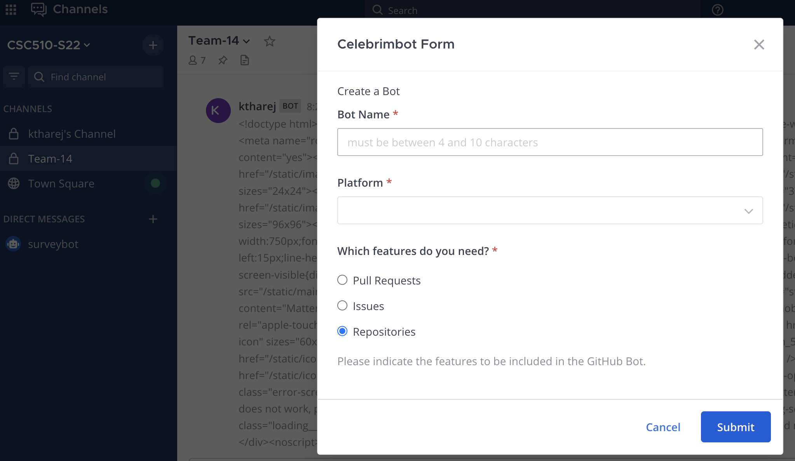
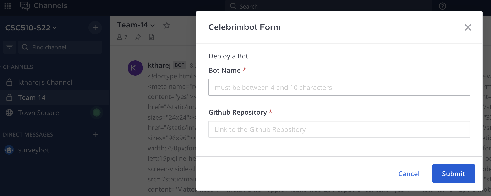

## Overview

## REST Web Service
The responder hosts a webservice to handle the /slashcommands from mattermost which supports following endpoints:
- /create : responds to /createbot command. It brings up the `Create a Bot` dialog.
- /deploy : responds to /deploybot command. It brings up the `Deploy a Bot` dialog.
- /submitcreate : handles the submit action for `Create a Bot` dialog.
- /submitdeploy : handles the submit action for `Deploy a Bot` dialog.

This server is implemented using `express`. 

### Running the server
Setup the following environment variables:
- DIALOG_URL
- SUBMIT_CREATE_URL
- SUBMIT_DEPLOY_URL
- TEAMBOTTOKEN

An example of the environment variables can be found here: `env.template`. Run the command below to setup the environment.

```
source env.template
```

To run the server, run:

```
npm install
node index.js
```

### Setup /slashcommands on mattermost
Setup the /createbot, /deploybot and /celebrimhelp commands by following the instructions indicated [here](https://developers.mattermost.com/integrate/admin-guide/admin-slash-commands/).


Command | Method | URL
------------ | ------------- | ------------- 
/createbot | POST | https:// [serverhostingwebservice] /create
/deploybot | POST | https:// [serverhostingwebservice] /deploy
/celebrimhelp | GET | https:// [serverhostingwebservice] /help



